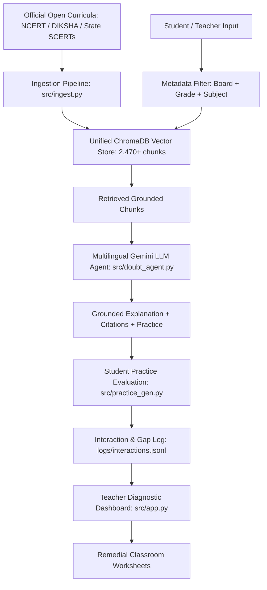

# Upay (उपाय) — AI for Equitable Education Access

> **Theme**: Education, Language Access, and Personalized Learning  
> **Challenge**: Build an AI system that closes the education access gap for students and teachers using open or public educational content as its knowledge base.

*Upay* (meaning "solution" or "remedy") is an open-source, curriculum-grounded AI tutoring and pedagogical intelligence platform. It connects a student's specific conceptual confusion to the exact textbook explanation, at the right grade level, in their native language—while giving teachers real-time diagnostic visibility into class-wide learning gaps.

---

## Key Capabilities

### 1. Grounded Multi-Grade Doubt Resolution (Classes 9–12)
* **Zero Hallucinations**: Every explanation is anchored strictly in official open textbooks (NCERT / State Boards).
* **Page-Level Citations**: All answers include verified citations with exact chapter and page numbers.
* **Multi-Grade Knowledge Base**: Pre-indexed with **2,470+ sections** across **Classes 9, 10, 11, and 12** covering Science, Mathematics, Physics, and Chemistry.
* **Curriculum Boundaries**: Metadata-filtered retrieval guarantees a Class 9 student is never given complex college-level calculus or ungrounded external formulas.

### 2. Equitable Language Access & Pedagogy Styles
* **Complete UI Localization (i18n)**: Switch the entire interface dynamically between **English**, **Hindi (हिन्दी)**, and **Hinglish**.
* **Multilingual Concept Tutoring**: Students can ask doubts in their native dialect and receive step-by-step grounded explanations in their preferred language.
* **Pedagogical Explanation Modes**:
  * *Standard Grounded*: Formal textbook explanation.
  * *Step-by-Step Breakdown*: Numbered conceptual points.
  * *Real-World Analogy*: Intuitive real-life metaphors for abstract concepts.

### 3. Interactive Adaptive Practice & AI Assessment
* **Grounded Question Generation**: Creates targeted practice questions synthesized directly from textbook sections.
* **Instant Student Answer Evaluation**: Students type their worked solutions into the app and receive immediate AI evaluation (score 0–100, identified misconceptions, and textbook model solutions).
* **Auto-Mastery Resolution**: Scoring $\ge 80\%$ automatically marks conceptual learning gaps as understood.

### 4. Teacher & Educator Diagnostic Hub
* **Classroom Risk Hierarchy**: Categorizes students by intervention priority (`[Critical Intervention]`, `[Needs Guidance]`, `[On Track]`).
* **1-Click Remedial Worksheets**: Teachers can select the class's top struggled concepts and generate a structured, printable classroom remedial worksheet in one click (downloadable as Markdown).
* **On-Demand Curriculum Ingestion**: Teachers or school administrators can upload any regional state board PDF directly in the UI to index it into ChromaDB in real-time.

---

## Architecture Overview



---

## Quickstart Guide

### 1. Clone the Repository

```bash
git clone https://github.com/Dissent-ofc/Upay.git
cd Upay
```

### 2. Create and Activate Virtual Environment (Recommended)

**Windows (PowerShell):**
```powershell
python -m venv venv
.\venv\Scripts\activate
```

**Mac / Linux:**
```bash
python3 -m venv venv
source venv/bin/activate
```

### 3. Install Dependencies

```bash
pip install -r requirements.txt
```

### 4. Configure Your Gemini API Key

Get a free key at [Google AI Studio](https://aistudio.google.com/apikey):

**Windows (PowerShell):**
```powershell
$env:GEMINI_API_KEY="your_api_key_here"
```

**Mac / Linux:**
```bash
export GEMINI_API_KEY="your_api_key_here"
```

### 5. Launch the Application

```bash
streamlit run src/app.py
```

The app will open in your browser at `http://localhost:8501`.

---

## Repository Structure

```
Upay/
├── .streamlit/
│   └── config.toml                  # Streamlit theme and performance configuration
├── data/
│   ├── raw_pdfs/                    # Curriculum PDFs: <Board>/<Grade>/<Subject>/chapter.pdf
│   │   └── CBSE/
│   │       ├── Class9/              # Science
│   │       ├── Class10/             # Science & Mathematics
│   │       ├── Class11/             # Physics & Chemistry
│   │       └── Class12/             # Physics, Chemistry & Mathematics
│   ├── processed/
│   │   └── chroma_db/               # Local embedded ChromaDB vector database
│   └── unsorted_pdfs/               # Staging area for auto-classification
├── src/
│   ├── app.py                       # Full localized Streamlit UI (Student + Teacher views)
│   ├── config.py                    # Central tunables (models, chunk size, thresholds)
│   ├── doubt_agent.py               # Multilingual grounded doubt-solving agent
│   ├── gap_tracker.py               # Student interaction logging & learning gap tracking
│   ├── ingest.py                    # Multi-grade PDF parser, chunker & ChromaDB indexer
│   ├── llm_client.py                # Gemini LLM client with error handling & retries
│   ├── practice_gen.py              # Adaptive practice generator & AI answer evaluator
│   ├── retriever.py                 # ChromaDB vector retrieval with metadata filtering
│   └── classify_pdfs.py             # LLM auto-classifier for unsorted textbook PDFs
├── scripts/
│   ├── bulk_download.py             # Automated downloader from open textbook mirrors
│   └── download_all_classes.txt     # Curriculum URL download manifest (Classes 9–12)
├── logs/
│   └── interactions.jsonl           # Append-only student interaction and gap log
├── requirements.txt                 # Project dependencies
├── .gitignore                       # Repository ignore rules
└── README.md                        # Documentation
```

---

## Scalability & Production Roadmap

1. **National Repository Integration**: Connect directly to **DIKSHA** and state **SCERT** open textbook APIs to expand beyond CBSE to all 28+ Indian state boards.
2. **Audio & Voice Access**: Integrate speech-to-text and text-to-speech for low-literacy students and voice-based doubt clearing.
3. **Offline & Low-Bandwidth Mode**: Bundle pre-computed ChromaDB indices with quantized local models (e.g. Gemma-2B) for completely offline school lab deployments.

---

## License & Attribution
* **Textbook Content**: Official curriculum PDFs distributed under open educational provisions (NCERT / Public Domain mirrors).
* **Software**: Distributed under the MIT License.
